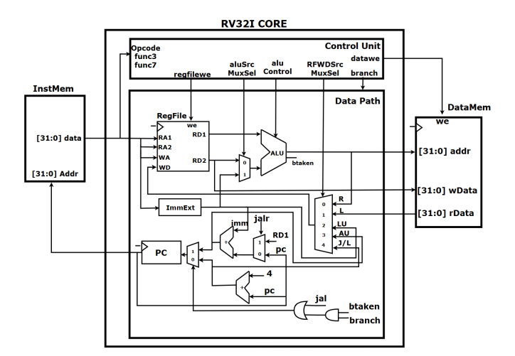

# RISC-V RV32I 기반 CPU Core 설계

2025.04.09 ~ 2025.04.13 (1人 프로젝트)

## 요약
RISC-V 명령어 구조(RV32I)를 기반으로 한 싱글 사이클 CPU Core를 SystemVerilog로 직접 설계하고, 각 명령어 타입(R/I/S/B/U/J Type)에 대한 시뮬레이션을 통해 기능 검증

- RV32I ISA의 6가지 명령어 형식을 모두 지원하는 싱글 사이클 CPU 설계
- ALU, 레지스터 파일, 제어 유닛, 메모리, PC/분기 처리 등 데이터패스 전체 구성
- 각 명령어에 대한 실행 흐름(연산, 제어, 분기)을 구분하여 블록 다이어그램 기반 구현
- ADD, SUB, LW, SW, BEQ, JAL 등 다양한 명령어의 시뮬레이션 결과 확인 및 동작 검증

## 역할
- Instruction Fetch → Decode → Execute 흐름에 따른 데이터 경로 및 제어 신호 설계
- RV32I 명령어 Type별 제어 흐름 정의 및 명령어 해석 로직 구현
- Load/Store, 분기(Branch), 점프(JAL, JALR) 등 메모리 및 제어 명령 처리 로직 구성
- Vivado 환경에서 명령어별 Simulation 수행 및 결과 분석

## 트러블 슈팅

### [1] Branch 명령어(BEQ, BNE 등) 오작동
#### 문제 상황:

BEQ, BNE 등 조건 분기 명령어 실행 시, 의도한 분기 주소로 이동하지 않거나 항상 분기 발생

#### 원인 분석:

ALU 비교 결과(btaken)를 분기 제어 신호(Branch)와 올바르게 연결하지 않아서 PCSrcMuxSel이 오동작

#### 해결 방법:

btaken 신호와 Branch 신호를 AND한 결과를 사용하여 분기 여부 결정. PCSrcMux 선택 조건을 정밀히 보정함

### [2] JALR 명령어에서 잘못된 점프 발생

#### 문제 상황:
JALR 실행 시, return address 저장은 정상이나 PC가 잘못된 주소로 점프함

#### 원인 분석:

JALR 명령어의 PC 계산식 PC = rs1 + imm 구현 시 즉시값(sign-extended imm) 처리에 오류가 있었음

#### 해결 방법:

ImmExtender 모듈 수정 및 rs1 + imm 연산 후 LSB 비트 0으로 마스킹 처리 (& ~1) 적용

## 고찰

 고찰 

이번 프로젝트는 고급 언어로 작성된 프로그램이 어떻게 하드웨어에서 실행되는지를 직접 구현하며 구조적으로 이해할 수 있었던 기회였다.

단순히 연산 처리뿐 아니라, 메모리 접근 및 제어 흐름(분기, 점프)을 담당하는 회로의 복잡성과 중요성을 실감하였다.

또한 명령어 흐름에 따라 데이터 경로와 제어 신호가 어떻게 달라지는지를 명확히 파악하고, 이를 SystemVerilog로 구현하며 하드웨어 설계에 대한 실무 감각을 키울 수 있었다.

앞으로 멀티사이클 혹은 파이프라인 구조 확장 시에도 본 프로젝트의 설계 경험이 중요한 기반이 될 것으로 기대된다.

