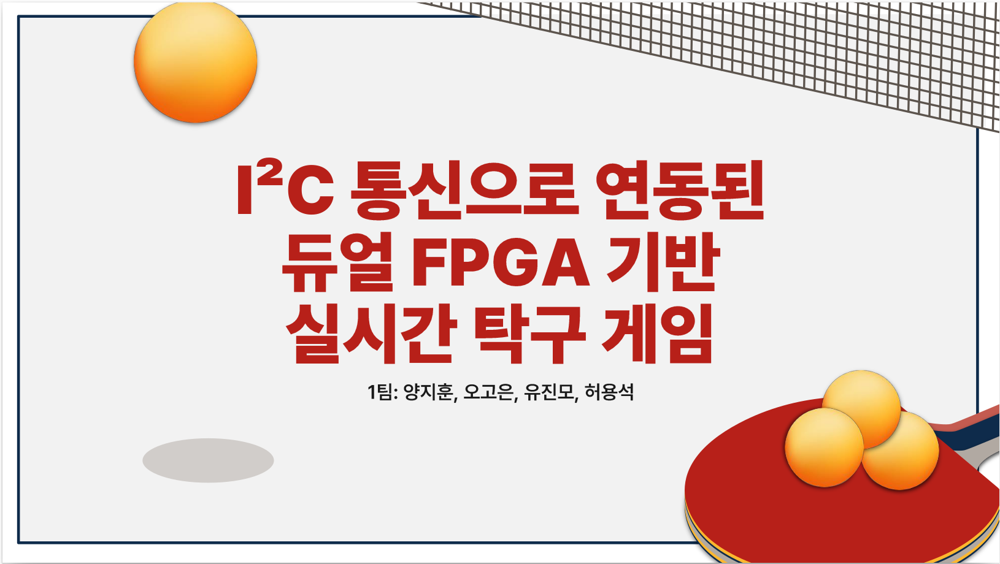

title: goeun's space
layout: page
---


<style>
@import url('https://fonts.googleapis.com/css2?family=Inter:wght@300;400;500;600;700&family=JetBrains+Mono:wght@400;500;600&display=swap');

* {
  margin: 0;
  padding: 0;
  box-sizing: border-box;
}

:root {
  --bg: #ffffff;
  --bg-light: #f8fafc;
  --text: #1a202c;
  --text-light: #4a5568;
  --text-lighter: #718096;
  --border: #e2e8f0;
  --accent: #3182ce;
  --accent-light: #bee3f8;
  --accent-hover: #2c5282;
  --font-sans: 'Inter', -apple-system, BlinkMacSystemFont, 'Segoe UI', Helvetica, Arial, sans-serif;
  --font-mono: 'JetBrains Mono', 'Monaco', 'Roboto Mono', monospace;
  --fz-xs: 13px;
  --fz-sm: 14px;
  --fz-md: 16px;
  --fz-lg: 18px;
  --fz-xl: 20px;
  --fz-xxl: 22px;
  --fz-heading: 32px;
  --nav-height: 70px;
  --border-radius: 8px;
  --section-padding: 100px;
  --max-width: 1400px;
  --transition: all 0.25s cubic-bezier(0.645, 0.045, 0.355, 1);
}

html {
  scroll-behavior: smooth;
}

body {
  margin: 0;
  width: 100%;
  min-height: 100%;
  overflow-x: hidden;
  background-color: var(--bg);
  color: var(--text);
  font-family: var(--font-sans);
  font-size: var(--fz-lg);
  line-height: 1.6;
  -webkit-font-smoothing: antialiased;
  -moz-osx-font-smoothing: grayscale;
  counter-reset: section;
}

.mdui-toolbar {
  position: fixed!important;
  width: 100%;
  top: 0 !important;
  z-index: 1000 !important;
  background-color: rgba(255, 255, 255, 0.95) !important;
  backdrop-filter: blur(10px) !important;
  border-bottom: 1px solid var(--border) !important;
  height: var(--nav-height) !important;
  padding: 0 50px !important;
  display: flex !important;
  align-items: center !important;
  gap: 30px;
  justify-content: flex-start !important;
}

.mdui-toolbar-spacer {
  flex-grow: 1;
}

.right-group {
  display: flex;
  align-items: center;
  gap: 24px;
}

.custom-nav {
  display: flex;
  gap: 20px;
}

.custom-nav-item {
  color: var(--text-light);
  font-size: var(--fz-md);
  font-weight: 500;
  padding: 8px 12px;
  border-radius: 6px;
  transition: var(--transition);
  text-decoration: none;
}

.custom-nav-item:hover,
.custom-nav-item.active {
  color: #ff4081;
}

.toolbar-left-group {
  display: flex;
  align-items: center;
  gap: 40px;
}

.site-title {
  font-size: 24px;
  font-weight: 700;
  font-family: var(--font-sans);
  letter-spacing: -0.02em;
  color: #ff4081 !important;
}

.site-title:hover {
  color: var(--accent-hover);
  transition: var(--transition);
  cursor: pointer;
  color: #ff4081 !important;
}

.custom-nav {
  display: flex;
  gap: 30px;
  align-items: center;
}

.mdui-card-primary-title,
.mdui-card-primary-subtitle,
.mdui-card-primary.mdui-ripple,
.mdui-m-x-0.mdui-m-t-4 {
  display: none !important;
}

.numbered-heading {
    font-family: __Black_Han_Sans_1e1a52,__Black_Han_Sans_Fallback_1e1a52 !important;
    font-style: normal !important;
    display: inline-block;
    margin: 0 auto 60px auto;
    font-size: 44px !important;
    font-weight: 800 !important;
    color: #000000;
    letter-spacing: 0.02em;
    text-transform: uppercase;
    -webkit-font-smoothing: antialiased;
    -moz-osx-font-smoothing: grayscale;
    text-rendering: optimizeLegibility;
    position: relative;
    white-space: nowrap;
    border-bottom: 3px solid #000000 !important;
    padding-bottom: 8px;
}

.about-info-grid {
    display: grid;
    grid-template-columns: repeat(3, 1fr);
    gap: 30px 40px;
    max-width: 1000px;
    margin: 0 auto;
    text-align: left;
}

.about-section {
    max-width: 1000px;
    margin: 0 auto;
    text-align: center;
    padding: var(--section-padding) 0;
}

.info-item {
    display: flex;
    align-items: flex-start;
    gap: 20px;
    padding: 20px;
    background: #ffffff;
    border: 1px solid #e5e7eb;
    border-radius: 8px;
    box-shadow: 0 1px 3px rgba(0, 0, 0, 0.1);
    transition: all 0.2s ease;
}

.info-icon {
    width: 24px;
    height: 24px;
    color: #000000;
    flex-shrink: 0;
    margin-top: 2px;
    display: flex;
    align-items: center;
    justify-content: center;
}

.info-content {
    flex: 1;
}

.info-label {
    font-size: 16px;
    font-weight: 600;
    color: #000000;
    margin-bottom: 4px;
    letter-spacing: -0.01em;
    -webkit-font-smoothing: antialiased;
    -moz-osx-font-smoothing: grayscale;
}

.info-value {
    font-size: 16px;
    color: #000000;
    line-height: 1.5;
    font-weight: 500;
    letter-spacing: -0.01em;
    -webkit-font-smoothing: antialiased;
    -moz-osx-font-smoothing: grayscale;
}

/* Skills Section 스타일 */
.skills-section {
    background:rgb(245, 245, 145);
    max-width: 1200px;
    margin: 0 auto;
    text-align: center;
    padding-bottom: 100px;
}

.skill-category-name {
  font-size: 18px;
  font-weight: 600;
  color: #2d3748;
}

.skill-row {
  display: grid;
  grid-template-columns: 40px 100px auto;
  align-items: center;
  gap: 20px;
  margin-bottom: 24px;
  padding-left: 20px;
}

.skills-container {
  padding-left: 24px !important;
  padding-right: 24px !important;
}

.skill-tag {
  white-space: nowrap !important;
  font-size: 0.875rem !important;
  padding: 0.25rem 0.75rem !important;
  border-radius: 0.5rem !important;
  font-weight: 500 !important;
  flex-shrink: 0;
  width: auto !important;
}

.skill-icon{
  width: 50px !important;
  height: 50px !important;
  margin: 0 auto !important;
  background: #fff !important;
  border: 2px solid #ddd !important;
  border-radius: 10px !important;
  display: flex !important;
  align-items: center !important;
  justify-content: center !important;
  color: #666 !important;
}

.skill-tags {
  display: flex;
  flex-wrap: wrap;
  justify-content: center;
  gap: 10px 12px;
}

.skill-tags.language-row,
.skill-tags.tools-row {
  justify-content: start !important;
  gap: 12px 16px !important;
  padding: 12px 0;
}

.language-row .skill-tag:nth-child(1) { background: #4a90e2; }
.language-row .skill-tag:nth-child(2) { background: #50c878; }
.language-row .skill-tag:nth-child(3) { background: #7b68ee; }
.language-row .skill-tag:nth-child(4) { background: #ff6b6b; }
.language-row .skill-tag:nth-child(5) { background: #ffa500; }

.tools-row .skill-tag:nth-child(1) { background: #4a90e2; }
.tools-row .skill-tag:nth-child(2) { background: #50c878; }
.tools-row .skill-tag:nth-child(3) { background: #7b68ee; }
.tools-row .skill-tag:nth-child(4) { background: #ff6b6b; }
.tools-row .skill-tag:nth-child(5) { background: #ffa500; }
.tools-row .skill-tag:nth-child(6) { background: #20b2aa; }

.skill-tag:hover {
    transform: translateY(-1px);
    box-shadow: 0 4px 8px rgba(0, 0, 0, 0.15);
}

/* 프로젝트 이미지 스타일 - Part 2에 추가/수정 */
.project-image {
    width: 100%;
    margin: 15px 0 20px 0;
    border-radius: 12px;
    overflow: hidden;
    box-shadow: 0 4px 12px rgba(0, 0, 0, 0.1);
    transition: all 0.3s ease;
    background: #f8f9fa; /* 이미지 배경색 */
}

.project-image img {
    width: 100%;
    height: 250px; /* 높이 증가 */
    object-fit: contain; /* cover → contain으로 변경 (잘림 방지) */
    object-position: center;
    transition: transform 0.3s ease;
    background: #ffffff; /* 이미지 자체 배경 */
}

.project-card:hover .project-image img {
    transform: scale(1.02); /* 확대 효과 줄임 */
}

.project-image img:hover {
    transform: scale(1.05); /* 확대 효과 줄임 */
}

/* 프로젝트별 이미지 높이 개별 조정 */
.project-card:nth-child(1) .project-image img {
    height: 280px; /* I2C FPGA 게임 - 가로가 긴 이미지 */
}

.project-card:nth-child(2) .project-image img {
    height: 260px; /* IT 엘도라도 */
}

.project-card:nth-child(3) .project-image img {
    height: 240px; /* FOSSLight */
}

.project-card:nth-child(4) .project-image img {
    height: 220px; /* react-bulk-form */
}

/* 이미지 비율 유지 옵션 (선택사항) */
.project-image.maintain-ratio img {
    height: auto;
    max-height: 250px;
    min-height: 180px;
}

/* 이미지 로딩 상태 */
.project-image img[src=""] {
    background: linear-gradient(90deg, #f0f0f0 25%, #e0e0e0 50%, #f0f0f0 75%);
    background-size: 200% 100%;
    animation: loading 1.5s infinite;
}

@keyframes loading {
    0% {
        background-position: 200% 0;
    }
    100% {
        background-position: -200% 0;
    }
}

/* 이미지 에러 상태 */
.project-image img:not([src]),
.project-image img[src=""] {
    background: #f8f9fa;
    display: flex;
    align-items: center;
    justify-content: center;
    color: #666;
    font-size: 14px;
}

.project-image img:not([src])::before {
    content: "이미지를 불러올 수 없습니다";
}

/* 이미지 여백 추가 (잘림 방지) */
.project-image.padded {
    padding: 10px;
    background: #ffffff;
}

.project-image.padded img {
    border-radius: 8px;
}

/* 모바일 반응형 */
@media (max-width: 768px) {
    .project-image {
        margin: 10px 0 15px 0;
    }
    
    .project-image img {
        height: 200px; /* 모바일에서 높이 조정 */
    }
    
    .project-card:nth-child(1) .project-image img {
        height: 220px; /* 모바일에서 I2C 프로젝트 */
    }
    
    .project-card:nth-child(2) .project-image img {
        height: 200px; /* 모바일에서 IT 엘도라도 */
    }
}

/* 🔥 추가 옵션: 이미지가 특히 잘릴 것 같은 경우 */
.project-image.full-view {
    padding: 15px;
    background: #f8f9fa;
}

.project-image.full-view img {
    object-fit: scale-down; /* 이미지가 완전히 보이도록 */
    max-width: 100%;
    max-height: 100%;
}
.projects-section {
    background: #f8fafc;
    max-width: 1200px;
    margin: 0 auto;
    text-align: center;
    padding: var(--section-padding) 0;
}

.filter-section {
    text-align: center;
    margin-bottom: 40px;
}

.filter-checkbox {
    margin: 0 10px;
    display: inline-flex;
    align-items: center;
    gap: 8px;
    font-size: 1.1rem;
    color: #2c3e50;
}

.filter-checkbox input[type="checkbox"] {
    width: 20px;
    height: 20px;
    accent-color: #ff4081;
}

.projects-grid {
    display: grid;
    grid-template-columns: repeat(auto-fit, minmax(450px, 1fr));
    gap: 30px;
    margin-top: 40px;
    padding: 0 20px;
}

.project-card {
    background: white;
    border-radius: 15px;
    padding: 30px;
    box-shadow: 0 10px 30px rgba(0,0,0,0.1);
    transition: all 0.3s ease;
    border: 1px solid #e0e0e0;
    position: relative;
    overflow: hidden;
    text-align: left;
    cursor: pointer;
}

.project-card::before {
    content: "";
    position: absolute;
    top: 0;
    left: 0;
    right: 0;
    height: 4px;
    background: linear-gradient(90deg, #e74c3c, #f39c12);
}

.project-card:nth-child(2)::before {
    background: linear-gradient(90deg, #3498db, #2ecc71);
}

.project-card:nth-child(3)::before {
    background: linear-gradient(90deg, #9b59b6, #e67e22);
}

.project-card:nth-child(4)::before {
    background: linear-gradient(90deg, #1abc9c, #16a085);
}

.project-card:nth-child(5)::before {
    background: linear-gradient(90deg, #f1c40f, #e67e22);
}

.project-card:nth-child(6)::before {
    background: linear-gradient(90deg, #e74c3c, #c0392b);
}

.project-card:hover {
    transform: translateY(-10px);
    box-shadow: 0 20px 40px rgba(0,0,0,0.15);
}

.project-header {
    display: flex;
    justify-content: space-between;
    align-items: flex-start;
    margin-bottom: 20px;
}

.project-title {
    background: #e74c3c;
    color: white;
    padding: 8px 16px;
    border-radius: 20px;
    font-size: 0.95rem;
    font-weight: 600;
    display: inline-block;
}

.project-card:nth-child(2) .project-title {
    background: #ff4081;
}

.project-card:nth-child(3) .project-title {
    background: #9b59b6;
}

.project-card:nth-child(4) .project-title {
    background: #1abc9c;
}

.project-card:nth-child(5) .project-title {
    background: #f1c40f;
    color: #333;
}

.project-card:nth-child(6) .project-title {
    background: #e74c3c;
}

.project-date {
    color: #7f8c8d;
    font-size: 0.9rem;
    font-weight: 500;
}

.project-name {
    font-size: 1.3rem;
    font-weight: 700;
    color: #2c3e50;
    margin: 15px 0;
    line-height: 1.4;
}

.project-description {
    margin-bottom: 25px;
}

.project-description ul {
    list-style: none;
    padding-left: 0;
    margin: 0;
}

.project-description li {
    margin-bottom: 12px;
    padding-left: 24px;
    position: relative;
    color: #2d3748;
    font-size: 1rem;
    line-height: 1.6;
    font-weight: 500;
    letter-spacing: -0.01em;
}

.project-description li::before {
    content: "•";
    color: #ff4081;
    position: absolute;
    left: 0;
    font-weight: bold;
    font-size: 1.1em;
    line-height:1.6;
}

.tech-stack {
    display: flex;
    flex-wrap: wrap;
    gap: 8px;
    margin-bottom: 20px;
}

.tech-tag {
    background: #f8f9fa;
    color: #495057;
    padding: 6px 12px;
    border-radius: 15px;
    font-size: 0.8rem;
    border: 1px solid #dee2e6;
    font-weight: 500;
}

.project-buttons {
    display: flex;
    gap: 15px;
}

.btn {
    padding: 10px 20px;
    border: none;
    border-radius: 25px;
    cursor: pointer;
    font-size: 0.9rem;
    font-weight: 600;
    text-decoration: none;
    display: inline-flex;
    align-items: center;
    gap: 8px;
    transition: all 0.3s ease;
}

.btn-primary {
    background: #2c3e50;
    color: white;
}

.btn-primary:hover {
    background: #34495e;
    transform: translateY(-2px);
}

.btn-secondary {
    background: #ecf0f1;
    color: #2c3e50;
    border: 1px solid #bdc3c7;
}

.btn-secondary:hover {
    background: #d5dbdb;
    transform: translateY(-2px);
}

/* README 모달 스타일 */
.modal-overlay {
    position: fixed;
    top: 0;
    left: 0;
    width: 100%;
    height: 100%;
    background: rgba(0, 0, 0, 0.8);
    display: none;
    justify-content: center;
    align-items: center;
    z-index: 2000;
    padding: 20px;
}

.modal-overlay.show {
    display: flex;
}

.modal-content {
    background: white;
    border-radius: 15px;
    max-width: 900px;
    max-height: 90vh;
    width: 100%;
    overflow: hidden;
    position: relative;
    animation: modalSlideIn 0.3s ease;
}

@keyframes modalSlideIn {
    from {
        opacity: 0;
        transform: translateY(-50px) scale(0.9);
    }
    to {
        opacity: 1;
        transform: translateY(0) scale(1);
    }
}

.modal-header {
    padding: 25px 30px 20px;
    border-bottom: 1px solid #e0e0e0;
    display: flex;
    justify-content: space-between;
    align-items: center;
    background: #f8fafc;
}

.modal-title {
    font-size: 1.5rem;
    font-weight: 700;
    color: #2c3e50;
    margin: 0;
}

.modal-close {
    background: none;
    border: none;
    font-size: 24px;
    cursor: pointer;
    color: #666;
    padding: 5px;
    line-height: 1;
    border-radius: 50%;
    width: 35px;
    height: 35px;
    display: flex;
    align-items: center;
    justify-content: center;
    transition: all 0.2s ease;
}

.modal-close:hover {
    background: #e0e0e0;
    color: #333;
}

.modal-body {
    padding: 30px;
    overflow-y: auto;
    max-height: calc(90vh - 100px);
}

/* README 내용 스타일 */
.readme-content {
    font-family: var(--font-sans);
    line-height: 1.7;
    color: #2d3748;
    font-size:1rem;
    font-weight:500;
}

.readme-content h1 {
    font-size: 2rem;
    font-weight: 700;
    color: #2c3e50;
    margin-bottom: 15px;
    border-bottom: 3px solid #3182ce;
    padding-bottom: 10px;
}

.readme-content h2 {
    font-size: 1.5rem;
    font-weight: 600;
    color: #2c3e50;
    margin: 25px 0 15px 0;
    display: flex;
    align-items: center;
    gap: 10px;
}

.readme-content h3 {
    font-size: 1.2rem;
    font-weight: 600;
    color: #4a5568;
    margin: 20px 0 10px 0;
    display: flex;
    align-items: center;
    gap: 8px;
    margin-bottom: 15px
}

.readme-content p {
    line-height: 1.7;
    margin-bottom: 15px;
    color: #2d3748;
    font-size:1rem;
    font-weight:500;
}

.readme-content ul {
    margin-bottom: 15px;
    padding-left: 25px;
}

.readme-content li {
    margin-bottom: 8px;
    line-height: 1.4;
    color:rgb(64, 71, 83);
    font-size: 1rem;
    font-weight: 400;
    padding-left: 8px;
}

.readme-content a {
    color: #3182ce;
    text-decoration: none;
    border-bottom: 1px solid transparent;
    transition: border-bottom-color 0.2s ease;
}

.readme-content a:hover {
    border-bottom-color: #3182ce;
}

.readme-content blockquote {
    background: #f8f9fa;
    border-left: 4px solid #ff4081;
    padding: 15px 20px;
    margin: 20px 0;
    font-style: italic;
    color: #4a5568;
}

.readme-content strong {
    color: #2d3748;
    font-weight: 600;
}

.loading-content {
    text-align: center;
    padding: 50px 20px;
    color: #666;
}
/* README 모달 내 이미지 및 GIF 스타일 - Part 3에 추가 */

/* 기본 이미지 스타일 */
.readme-content img {
    max-width: 100%;
    height: auto;
    border-radius: 8px;
    box-shadow: 0 4px 12px rgba(0, 0, 0, 0.1);
    margin: 20px 0;
    display: block;
    transition: transform 0.3s ease;
}

.readme-content img:hover {
    transform: scale(1.02);
    box-shadow: 0 6px 20px rgba(0, 0, 0, 0.15);
}

/* GIF 전용 스타일 */
.readme-content img[src*=".gif"] {
    border: 2px solid #e2e8f0;
    border-radius: 12px;
    background: #f8fafc;
    padding: 4px;
    margin: 25px 0;
    box-shadow: 0 8px 25px rgba(0, 0, 0, 0.1);
}

.readme-content img[src*=".gif"]:hover {
    transform: scale(1.05);
    border-color: #3182ce;
    box-shadow: 0 12px 30px rgba(0, 0, 0, 0.2);
}

/* 큰 GIF (메인 데모용) */
.readme-content img[alt*="플레이"],
.readme-content img[alt*="데모"],
.readme-content img[alt*="시연"] {
    max-width: 100%;
    min-height: 300px;
    object-fit: contain;
    background: #000;
    border-radius: 16px;
    margin: 30px 0;
    box-shadow: 0 10px 30px rgba(0, 0, 0, 0.2);
}

/* 작은 GIF (기능 설명용) */
.readme-content img[alt*="기능"],
.readme-content img[alt*="과정"],
.readme-content img[alt*="화면"] {
    max-width: 400px;
    margin: 15px auto;
    display: block;
}

/* 이미지 캡션 스타일 */
.readme-content p img + br + em,
.readme-content p img + em {
    display: block;
    text-align: center;
    font-size: 0.9em;
    color: #718096;
    margin-top: 8px;
    font-style: italic;
}

/* 이미지 그룹 (여러 이미지를 나란히) */
.readme-content .image-group {
    display: flex;
    gap: 15px;
    margin: 25px 0;
    flex-wrap: wrap;
    justify-content: center;
}

.readme-content .image-group img {
    flex: 1;
    min-width: 200px;
    max-width: 300px;
    margin: 0;
}

/* 로딩 상태 */
.readme-content img[src=""] {
    background: linear-gradient(90deg, #f0f0f0 25%, #e0e0e0 50%, #f0f0f0 75%);
    background-size: 200% 100%;
    animation: imageLoading 1.5s infinite;
    min-height: 200px;
}

@keyframes imageLoading {
    0% {
        background-position: 200% 0;
    }
    100% {
        background-position: -200% 0;
    }
}

/* README 이미지 래퍼 CSS - Part 3에 추가 */
.readme-image-wrapper {
    text-align: center;
    margin: 25px 0;
    line-height: 0; /* 이미지 아래 여백 제거 */
}

.readme-image-wrapper img {
    display: inline-block;
    max-width: 100%;
    height: auto;
    border-radius: 8px;
    box-shadow: 0 4px 12px rgba(0, 0, 0, 0.1);
    transition: transform 0.3s ease;
}
.readme-image-wrapper img:hover {
    transform: scale(1.02);
    box-shadow: 0 6px 20px rgba(0, 0, 0, 0.15);
}

/* GIF 특별 처리 */
.readme-image-wrapper img[src*=".gif"] {
    border: 2px solid #e2e8f0;
    border-radius: 12px;
    background: #f8fafc;
    padding: 4px;
}

.readme-image-wrapper img[src*=".gif"]:hover {
    border-color: #3182ce;
    transform: scale(1.05);
}

/* 이미지 에러 처리 */
.image-error {
    margin: 20px 0;
}

/* 모바일 반응형 */
@media (max-width: 768px) {
    .readme-image-wrapper {
        margin: 15px 0;
    }
    
    .readme-image-wrapper img {
        border-radius: 6px;
    }
}
/* 이미지 에러 상태 */
.readme-content img:not([src]),
.readme-content img[alt]:not([src]) {
    background: #f8f9fa;
    border: 2px dashed #cbd5e0;
    color: #718096;
    display: flex;
    align-items: center;
    justify-content: center;
    min-height: 150px;
    font-size: 14px;
    text-align: center;
}

.readme-content img:not([src])::after {
    content: "🖼️ 이미지를 불러올 수 없습니다";
}

/* 모바일 반응형 */
@media (max-width: 768px) {
    .readme-content img {
        margin: 15px 0;
        border-radius: 6px;
    }
    
    .readme-content img[src*=".gif"] {
        margin: 20px 0;
        padding: 2px;
    }
    
    .readme-content img[alt*="플레이"],
    .readme-content img[alt*="데모"],
    .readme-content img[alt*="시연"] {
        min-height: 200px;
        margin: 20px 0;
    }
    
    .readme-content .image-group {
        flex-direction: column;
        gap: 10px;
    }
    
    .readme-content .image-group img {
        max-width: 100%;
        min-width: auto;
    }
}

/* 🔥 특별한 GIF 효과 */
.readme-content img[src*=".gif"]:hover::after {
    content: "▶️ 재생 중";
    position: absolute;
    bottom: 10px;
    right: 10px;
    background: rgba(0, 0, 0, 0.8);
    color: white;
    padding: 4px 8px;
    border-radius: 4px;
    font-size: 12px;
}

/* 고해상도 GIF 처리 */
.readme-content img[src*=".gif"][width],
.readme-content img[src*=".gif"][height] {
    max-width: 100% !important;
    height: auto !important;
}
.loading-spinner {
    width: 40px;
    height: 40px;
    border: 4px solid #f3f3f3;
    border-top: 4px solid #3182ce;
    border-radius: 50%;
    animation: spin 1s linear infinite;
    margin: 0 auto 20px;
}

@keyframes spin {
    0% { transform: rotate(0deg); }
    100% { transform: rotate(360deg); }
}

.error-content {
    text-align: center;
    padding: 50px 20px;
    color: #e53e3e;
}

/* 모바일 반응형 스타일 */
@media (max-width: 768px) {
    .custom-nav {
        display: none !important;
    }
    
    .right-group {
        display: none !important;
    }
    
    .mdui-toolbar {
        padding: 0 20px !important;
        justify-content: space-between !important;
    }
    
    .site-title {
        font-size: 22px !important;
        font-weight: 700 !important;
        white-space: nowrap !important;
        flex: 1 !important;
        text-align: center !important;
        margin: 0 20px !important;
    }
    
    .numbered-heading {
        font-size: 32px !important;
    }
    
    .about-info-grid {
        grid-template-columns: 1fr !important;
        gap: 20px !important;
        padding: 0 20px !important;
    }

    .projects-grid {
        grid-template-columns: 1fr;
        gap: 20px;
        padding: 0 10px;
    }
    
    .project-card {
        padding: 20px;
    }
    
    .project-header {
        flex-direction: column;
        gap: 10px;
        align-items: flex-start;
    }
    
    .project-buttons {
        flex-direction: column;
        gap: 10px;
    }
    
    .btn {
        justify-content: center;
        text-align: center;
    }
    
    .tech-stack {
        justify-content: center;
    }

    .modal-content {
        margin: 10px;
        max-height: 95vh;
    }

    .modal-header {
        padding: 20px;
    }

    .modal-body {
        padding: 20px;
    }

    .readme-content h1 {
        font-size: 1.6rem;
    }

    .skill-row {
        grid-template-columns: 1fr !important;
        text-align: center !important;
        gap: 15px !important;
        margin-bottom: 30px !important;
        padding: 16px !important;
        background: rgba(255, 255, 255, 0.7) !important;
        border-radius: 12px !important;
    }

    .skill-icon {
        margin: 0 auto !important;
    }

    .skill-tags {
        justify-content: center !important;
    }

    .skill-tag {
        white-space: normal !important;
        word-break: break-word !important;
        min-width: 60px !important;
        max-width: 100% !important;
        text-align: center !important;
        padding: 6px 8px !important;
    }
}

@media (max-width: 375px) {
    .site-title {
        font-size: 16px !important;
        max-width: calc(100vw - 100px) !important;
    }
    
    .mdui-toolbar {
        padding: 0 10px !important;
    }
}

@media (max-width: 1024px) and (min-width: 769px) {
    .about-info-grid {
        grid-template-columns: repeat(2, 1fr);
        gap: 25px 30px;
    }
}
</style>

<!-- Main Content -->
<div class="main">
<section id="about" class="about-section">
    <h2 class="numbered-heading">ABOUT ME</h2>
    <div class="about-info-grid">
        <div class="info-item">
            <div class="info-icon">
                <svg width="24" height="24" viewBox="0 0 24 24" fill="currentColor">
                    <path d="M12 12c2.21 0 4-1.79 4-4s-1.79-4-4-4-4 1.79-4 4 1.79 4 4 4zm0 2c-2.67 0-8 1.34-8 4v2h16v-2c0-2.66-5.33-4-8-4z"/>
                </svg>
            </div>
            <div class="info-content">
                <div class="info-label">이름</div>
                <div class="info-value">오고은</div>
            </div>
        </div>
        <div class="info-item">
            <div class="info-icon">
                <svg width="24" height="24" viewBox="0 0 24 24" fill="currentColor">
                    <path d="M19 3h-1V1h-2v2H8V1H6v2H5c-1.11 0-1.99.9-1.99 2L3 19c0 1.1.89 2 2 2h14c1.1 0 2-.9 2-2V5c0-1.1-.9-2-2-2zm0 16H5V8h14v11zM7 10h5v5H7z"/>
                </svg>
            </div>
            <div class="info-content">
                <div class="info-label">생년월일</div>
                <div class="info-value">98.01.10</div>
            </div>
        </div>
        <div class="info-item">
            <div class="info-icon">
                <svg width="24" height="24" viewBox="0 0 24 24" fill="currentColor">
                    <path d="M12 2C8.13 2 5 5.13 5 9c0 5.25 7 13 7 13s7-7.75 7-13c0-3.87-3.13-7-7-7zm0 9.5c-1.38 0-2.5-1.12-2.5-2.5s1.12-2.5 2.5-2.5 2.5 1.12 2.5 2.5-1.12 2.5-2.5 2.5z"/>
            </svg>
            </div>
            <div class="info-content">
                <div class="info-label">위치</div>
                <div class="info-value">경기도 용인시</div>
            </div>
        </div>
        <div class="info-item">
            <div class="info-icon">
                <svg width="24" height="24" viewBox="0 0 24 24" fill="currentColor">
                    <path d="M6.62 10.79c1.44 2.83 3.76 5.14 6.59 6.59l2.2-2.2c.27-.27.67-.36 1.02-.24 1.12.37 2.33.57 3.57.57.55 0 1 .45 1 1V20c0 .55-.45 1-1 1-9.39 0-17-7.61-17-17 0-.55.45-1 1-1h3.5c.55 0 1 .45 1 1 0 1.25.2 2.45.57 3.57.11.35.03.74-.25 1.02l-2.2 2.2z"/>
                </svg>
            </div>
            <div class="info-content">
                <div class="info-label">연락처</div>
                <div class="info-value">010-7251-3263</div>
            </div>
        </div>
        <div class="info-item">
            <div class="info-icon">
                <svg width="24" height="24" viewBox="0 0 24 24" fill="currentColor">
                    <path d="M20 4H4c-1.1 0-1.99.9-1.99 2L2 18c0 1.1.9 2 2 2h16c1.1 0 2-.9 2-2V6c0-1.1-.9-2-2-2zm0 4l-8 5-8-5V6l8 5 8-5v2z"/>
                </svg>
            </div>
            <div class="info-content">
                <div class="info-label">이메일</div>
                <div class="info-value">qw433812@gmail.com</div>
            </div>
        </div>
        <div class="info-item">
            <div class="info-icon">
                <svg width="24" height="24" viewBox="0 0 24 24" fill="currentColor">
                    <path d="M5 13.18v4L12 21l7-3.82v-4L12 17l-7-3.82zM12 3L1 9l11 6 9-4.91V17h2V9L12 3z"/>
                </svg>
            </div>
            <div class="info-content">
                <div class="info-label">학력</div>
                <div class="info-value">아주대학교 (전자공학과)</div>
            </div>
        </div>
    </div>
</section>

<!-- Skills Section -->
<section id="skills" class="skills-section">
    <h2 class="numbered-heading">SKILLS</h2>
    <div class="skills-container">
        <div class="skill-row">
            <div class="skill-icon">
                <svg viewBox="0 0 24 24" fill="currentColor">
                    <path d="M9.4 16.6L4.8 12l4.6-4.6L8 6l-6 6 6 6 1.4-1.4zm5.2 0L19.2 12l-4.6-4.6L16 6l6 6-6 6-1.4-1.4z"/>
                </svg>
            </div>
            <div class="skill-category-name">Language</div>
            <div class="skill-tags language-row">
                <div class="skill-tag">Verilog</div>
                <div class="skill-tag">SystemVerilog</div>
                <div class="skill-tag">Python</div>
                <div class="skill-tag">Java</div>
                <div class="skill-tag">C</div>
            </div>
        </div>
        <div class="skill-row">
            <div class="skill-icon">
                <svg viewBox="0 0 24 24" fill="currentColor">
                    <path d="M22.7 19l-9.1-9.1c.9-2.3.4-5-1.5-6.9-2-2-5-2.4-7.4-1.3L9 6 6 9 1.6 4.7C.4 7.1.9 10.1 2.9 12.1c1.9 1.9 4.6 2.4 6.9 1.5l9.1 9.1c.4.4 1 .4 1.4 0l2.3-2.3c.5-.4.5-1.1.1-1.4z"/>
                </svg>
            </div>
            <div class="skill-category-name">Tools</div>
            <div class="skill-tags tools-row">
                <span class="skill-tag">Vivado</span>
                <span class="skill-tag">Vitis</span>
                <span class="skill-tag">ModelSim</span>
                <span class="skill-tag">PsPice</span>
                <span class="skill-tag">Synopsys Verdi</span>
                <span class="skill-tag">Synopsys VCS</span>
            </div>
        </div>
    </div>
</section>

<!-- Projects Section -->
<section id="projects" class="projects-section">
    <h2 class="numbered-heading">PROJECTS</h2>
    <div class="filter-section">
        <label class="filter-checkbox">
            <input type="checkbox" id="filter-projects" checked>
            주요 프로젝트만 보기
        </label>
    </div>
    <div class="projects-grid">
        <!-- Project 1 -->
        <div class="project-card" data-readme="i2c_vga_videoProcessing">
            <div class="project-header">
                <span class="project-title">vga 영상처리</span>
                <span class="project-date">2025.06.03 ~ 2025.06.12 (4人 팀 프로젝트) </span>
            </div>
            <h3 class="project-name">I2C 통신 기반 듀얼 FPGA 탁구 게임</h3>
                        <!-- 🔥 프로젝트 이미지 추가 -->
            <!-- 프로젝트 이미지 -->
            <div class="project-image">
                
            </div>
            <div class="project-description">
                <ul>
                    <li>FPGA 기반 VGA 영상처리 시스템 구현</li>
                    <li>특정 색상 충돌 감지 및 물리 모델 기반 운동 시뮬레이션</li>
                    <li>I2C 통신을 통해 2개 보드 간 공의 좌표를 공유하여 2인 게임으로 확장</li>
                </ul>
            </div>
            <div class="tech-stack">
                <span class="tech-tag">systemVerilog</span>
                <span class="tech-tag">Vivado</span>
                <span class="tech-tag">Python</span>
                <span class="tech-tag">Github</span>
                <span class="tech-tag">Jira</span>
            </div>
        </div>
        <!-- Project 2: IT 엘도라도 블로그 -->
        <div class="project-card" data-readme="I2C">
            <div class="project-header">
                <span class="project-title">IT 엘도라도 (블로그)</span>
                <span class="project-date">2024.09 (1人 개인 프로젝트)</span>
            </div>
            <h3 class="project-name">Notion API/DB와 연동하여 개발한 개인 블로그</h3>
            <div class="project-description">
                <ul>
                    <li>티스토리 블로그에서의 불편함을 해소하고자 직접 개발</li>
                    <li>별도의 데이터베이스 서버 없이 Notion API/DB와 연동하여 개발</li>
                    <li>감성 연간 최적화(SEO) 고도화 및 검색 마이그레이션 등의 기능</li>
                    <li>무한 스크롤, 방문/조회 수 추적, 댓글/좋아요 등의 커뮤니티 기능 개발</li>
                </ul>
            </div>
            <div class="tech-stack">
                <span class="tech-tag">TypeScript</span>
                <span class="tech-tag">Next.js</span>
                <span class="tech-tag">Zustand</span>
                <span class="tech-tag">React-Query</span>
                <span class="tech-tag">Tailwind CSS</span>
                <span class="tech-tag">Notion</span>
                <span class="tech-tag">Vercel</span>
            </div>
        </div>
        <!-- Project 3: FOSSLight Hub Lite -->
        <div class="project-card" data-readme="fosslight">
            <div class="project-header">
                <span class="project-title">FOSSLight Hub Lite</span>
                <span class="project-date">2023.09 - 2023.12 (2人 팀 프로젝트)</span>
            </div>
            <h3 class="project-name">LG 전자의 FOSSLight Hub 웹사이트를 사용자 기능 중심으로 리모델링한 웹사이트</h3>
            <div class="project-description">
                <ul>
                    <li>LG 전자에서 라이선스 어디 사용자를 위한 간소화 버전의 웹사이트 개발을 요청</li>
                    <li>기존 FOSSLight Hub 프로젝트의 환경에 특사시 기존 사용자들의 접근성 화면</li>
                    <li>내부 UI 웹이 리신시 서클 취득 서비스 화 시 자상하들의 안내성 화인</li>
                    <li>URL 위리 라이터피어 연동하는 정보/빌더 기능 및 모의 발기/단기 기능 구현</li>
                    <li>전반적인 UI/UX를 새롭게 설계하여 종합적인 사용성 개선</li>
                </ul>
            </div>
            <div class="tech-stack">
                <span class="tech-tag">TypeScript</span>
                <span class="tech-tag">Next.js</span>
                <span class="tech-tag">Recoil</span>
                <span class="tech-tag">React-Query</span>
                <span class="tech-tag">React-Hook-Form</span>
                <span class="tech-tag">Tailwind CSS</span>
            </div>
            <div class="project-buttons">
                <a href="#" class="btn btn-primary" onclick="event.stopPropagation(); openReadme('fosslight')">📖 README</a>
                <a href="#" class="btn btn-secondary">🎥 영상</a>
            </div>
        </div>
        <!-- Project 4: 메이플 경매장 올리기 -->
        <div class="project-card">
            <div class="project-header">
                <span class="project-title">메이플 경매장 올리기</span>
                <span class="project-date">2023.08 - 2023.09 (2人 팀 프로젝트)</span>
            </div>
            <h3 class="project-name">메이플스토리의 아이템이 찾아는 조건으로 경매장에 올리곤을 떼 일일펄을 받아보기 위한 웹사이트</h3>
            <div class="project-description">
                <ul>
                    <li>메이플스토리 특정 아이템의 확정적인 아이템이 찾아하여 개발</li>
                    <li>Nexus의 React 18 기반의 Next.js 13 업을 및 측위</li>
                    <li>React-Query, React-Hook-Form을 활용하여 API 요청 및 입력 폼 처리</li>
                    <li>Next.js 서버를 리페삼 프밗시를 활용하여 IP 노출 및 CORS 문제 해결</li>
                </ul>
            </div>
            <div class="tech-stack">
                <span class="tech-tag">TypeScript</span>
                <span class="tech-tag">Next.js</span>
                <span class="tech-tag">Recoil</span>
                <span class="tech-tag">React-Query</span>
                <span class="tech-tag">React-Hook-Form</span>
                <span class="tech-tag">Sass</span>
                <span class="tech-tag">Tailwind CSS</span>
                <span class="tech-tag">Vercel</span>
            </div>
            <div class="project-buttons">
                <a href="#" class="btn btn-primary">📖 README</a>
                <a href="#" class="btn btn-secondary">🖥 이미지</a>
            </div>
        </div>
        <!-- Project 5: 우는 노래 부우자? -->
        <div class="project-card">
            <div class="project-header">
                <span class="project-title">우는 노래 부우자?</span>
                <span class="project-date">2022.10 (1人 개인 프로젝트)</span>
            </div>
            <h3 class="project-name">ㄴ괄퇴을 즐기는 사람이 고종 부르면 노괘를 러반찮게 관리하는 사이트</h3>
            <div class="project-description">
                <ul>
                    <li>• 노래방에서 과려서 어떤 노래를 부를지 고민하는 사람들을 위한 서비스</li>
                    <li>• 남/여 기준시 연평곞 서치인 API 화이니딩롲적 아리솮니 프러닛</li>
                    <li>• 위밀여 모적 흰 노래와 활용된 ㅋ구분 체계와 체분법현대학명 시스토리 일어반다</li>
                </ul>
            </div>
            <div class="tech-stack">
                <span class="tech-tag">HTML</span>
                <span class="tech-tag">CSS</span>
                <span class="tech-tag">JavaScript</span>
            </div>
            <div class="project-buttons">
                <a href="#" class="btn btn-primary">📖 README</a>
            </div>
        </div>
        <!-- Project 6: 독특하게 사랑하기 (React-Native) -->
        <div class="project-card">
            <div class="project-header">
                <span class="project-title">독특하게 사랑하기 (React-Native)</span>
                <span class="project-date">2022.02 (1人 개인 프로젝트)</span>
            </div>
            <h3 class="project-name">분장한 시행 사용한 노그 능구에 연네울 비니저 정시 개선행들프</h3>
            <div class="project-description">
                <ul>
                    <li>분장한 시행 사용한 노그 능구에 연네울 비니저 정시 개선행들프</li>
                    <li>React Nitve 기반의 모바일 펍플쇭 결화</li>
                    <li>노규 접 받다 무드파트 관벅 관점과 감정을 더해 있는 성능 최적화</li>
                </ul>
            </div>
            <div class="tech-stack">
                <span class="tech-tag">React-Native</span>
                <span class="tech-tag">JavaScript</span>
            </div>
            <div class="project-buttons">
                <a href="#" class="btn btn-primary">📖 README</a>
            </div>
        </div>
    </div>
</section>
</div>
<!-- README 모달 -->
<div id="readmeModal" class="modal-overlay">
    <div class="modal-content">
        <div class="modal-header">
            <h2 class="modal-title" id="modalTitle">README.md</h2>
            <button class="modal-close" onclick="closeReadme()">&times;</button>
        </div>
        <div class="modal-body">
            <div id="readmeContent" class="readme-content">
                <!-- README 내용이 여기에 동적으로 삽입됩니다 -->
            </div>
        </div>
    </div>
</div>

<script>
// 페이지 로드 후 네비게이션 메뉴 동적 추가
document.addEventListener('DOMContentLoaded', function () {
  const toolbar = document.querySelector('.mdui-toolbar');
  if (toolbar) {
    const spacer = document.querySelector('.mdui-toolbar-spacer') ||
                   toolbar.querySelector('div[class*=spacer]');

    // 로고
    const siteTitle = document.createElement('div');
    siteTitle.className = 'site-title';
    siteTitle.textContent = "Goeun's Space";
    
    // 모바일에서 스타일 직접 적용
    if (window.innerWidth <= 768) {
        siteTitle.style.fontSize = '20px';
        siteTitle.style.whiteSpace = 'nowrap';
        siteTitle.style.overflow = 'visible';
        siteTitle.style.textOverflow = 'unset';
        siteTitle.style.maxWidth = 'none';
        siteTitle.style.flex = '1';
        siteTitle.style.textAlign = 'center';
        siteTitle.style.margin = '0 15px';
    }

    // 오른쪽 네비 메뉴
    const navMenu = document.createElement('div');
    navMenu.className = 'custom-nav';
    navMenu.innerHTML = `
      <a class="custom-nav-item active" onclick="scrollToSection('about')">About me</a>
      <a class="custom-nav-item" onclick="scrollToSection('skills')">Skills</a>
      <a class="custom-nav-item" onclick="scrollToSection('projects')">Projects</a>
      <a class="custom-nav-item" onclick="scrollToSection('contact')">Contact</a>
    `;

    // 오른쪽 그룹: 네비 + 검색
    const rightGroup = document.createElement('div');
    rightGroup.className = 'right-group';
    rightGroup.style.display = 'flex';
    rightGroup.style.alignItems = 'center';
    rightGroup.style.gap = '24px';
    
    // 모바일에서는 네비게이션 숨기기
    if (window.innerWidth <= 768) {
        navMenu.style.display = 'none';
    }
    rightGroup.appendChild(navMenu);

    // 검색 버튼도 오른쪽 그룹에 포함
    const search = toolbar.querySelector('a[href="/search/"]');
    if (search) rightGroup.appendChild(search);

    // 햄버거 다음에 로고 추가
    const menuButton = toolbar.querySelector('button');
    if (menuButton) toolbar.insertBefore(siteTitle, menuButton.nextSibling);

    // spacer 뒤에 오른쪽 그룹 삽입
    if (spacer) toolbar.insertBefore(rightGroup, spacer.nextSibling);
  }
});

// 섹션 스크롤
function scrollToSection(sectionId) {
  const element = document.getElementById(sectionId);
  if (element) {
    element.scrollIntoView({
      behavior: 'smooth'
    });
  }
}

// 스크롤 시 네비게이션 업데이트
window.addEventListener('scroll', function() {
  const sections = ['about', 'skills', 'projects', 'contact'];
  const navItems = document.querySelectorAll('.custom-nav-item');
  
  let current = '';
  sections.forEach(section => {
    const element = document.getElementById(section);
    if (element) {
      const rect = element.getBoundingClientRect();
      if (rect.top <= 150 && rect.bottom >= 150) {
        current = section;
      }
    }
  });
  
  // 네비게이션 업데이트
  navItems.forEach((item, index) => {
    item.classList.remove('active');
    if (sections[index] === current) {
      item.classList.add('active');
    }
  });
});

// 프로젝트 필터 기능
document.addEventListener('DOMContentLoaded', function() {
    const filterCheckbox = document.getElementById('filter-projects');
    const projectCards = document.querySelectorAll('.project-card');
    
    if (filterCheckbox) {
        filterCheckbox.addEventListener('change', function() {
            projectCards.forEach((card, index) => {
                if (this.checked) {
                    // 주요 프로젝트만 보기 (처음 4개만 표시)
                    card.style.display = index < 4 ? 'block' : 'none';
                } else {
                    // 모든 프로젝트 보기
                    card.style.display = 'block';
                }
            });
        });
        
        // 초기값 설정
        filterCheckbox.dispatchEvent(new Event('change'));
    }
});

// 프로젝트 카드 클릭 이벤트 (README가 있는 경우)
document.addEventListener('DOMContentLoaded', function() {
    const projectCards = document.querySelectorAll('.project-card[data-readme]');
    
    projectCards.forEach(card => {
        card.addEventListener('click', function() {
            const readmeFile = this.getAttribute('data-readme');
            if (readmeFile) {
                openReadme(readmeFile);
            }
        });
    });
});

// README 모달 관련 함수들 - skip_render 사용
function openReadme(projectId) {
    const modal = document.getElementById('readmeModal');
    const modalTitle = document.getElementById('modalTitle');
    const readmeContent = document.getElementById('readmeContent');
    
    // 로딩 상태 표시
    modalTitle.textContent = 'README.md';
    readmeContent.innerHTML = `
        <div class="loading-content">
            <div class="loading-spinner"></div>
            <p>README 파일을 불러오는 중...</p>
        </div>
    `;
    
    modal.classList.add('show');
    document.body.style.overflow = 'hidden';
    
    // ✅ skip_render 덕분에 이제 이 경로가 작동합니다!
    const readmeUrl = `readmes/${projectId}.md`;
    
    fetch(readmeUrl)
        .then(response => {
            if (!response.ok) {
                throw new Error(`README 파일을 찾을 수 없습니다: ${response.status}`);
            }
            return response.text();
        })
        .then(markdownText => {
            // 간단한 마크다운 파싱
            const htmlContent = parseMarkdown(markdownText);
            readmeContent.innerHTML = htmlContent;
            
            // 프로젝트 이름을 타이틀로 설정
            const projectTitles = {
                'it-eldorado': 'IT 엘도라도 (블로그)',
                'fosslight': 'FOSSLight Hub Lite',
                'i2c_vga_videoProcessing': 'i2c 통신 기반 듀얼 FPGA 탁구 게임'
            };
            modalTitle.textContent = projectTitles[projectId] || 'README.md';
        })
        .catch(error => {
            console.error('README 로딩 오류:', error);
            readmeContent.innerHTML = `
                <div class="error-content">
                    <h3>❌ 오류가 발생했습니다</h3>
                    <p>${error.message}</p>
                    <p>README 파일이 아직 준비되지 않았을 수 있습니다.</p>
                </div>
            `;
        });
}

// README 모달 닫기
function closeReadme() {
    const modal = document.getElementById('readmeModal');
    modal.classList.remove('show');
    document.body.style.overflow = 'auto';
}

// 개선된 마크다운 파서 - Part 6의 parseMarkdown 함수 교체
function parseMarkdown(markdown) {
    let html = markdown;
    
    // 🔥 이미지 먼저 처리 (링크보다 우선)
    html = html.replace(/!\[([^\]]*)\]\(([^)]+)\)/g, '');
    
    // 제목들
    html = html.replace(/^# (.*$)/gm, '<h1>$1</h1>');
    html = html.replace(/^## (.*$)/gm, '<h2>$1</h2>');
    html = html.replace(/^### (.*$)/gm, '<h3>$1</h3>');
    
    // 강조
    html = html.replace(/\*\*(.*?)\*\*/g, '<strong>$1</strong>');
    html = html.replace(/\*(.*?)\*/g, '<em>$1</em>');
    
    // 링크 (이미지 처리 후)
    html = html.replace(/\[([^\]]+)\]\(([^)]+)\)/g, '<a href="$2" target="_blank">$1</a>');
    
    // 인용구
    html = html.replace(/^> (.*)$/gm, '<blockquote>$1</blockquote>');
    
    // 🔥 리스트 처리 개선
    html = html.replace(/^- (.*)$/gm, '<li>$1</li>');
    
    // 연속된 li를 ul로 감싸기
    html = html.replace(/(<li>.*<\/li>[\s\S]*?<li>.*<\/li>)/g, function(match) {
        return '<ul>' + match + '</ul>';
    });
    
    // 단일 li도 ul로 감싸기
    html = html.replace(/(<li>.*<\/li>)(?!\s*<\/ul>)(?!\s*<li>)/g, '<ul>$1</ul>');
    
    // 🔥 코드 블록 처리
    html = html.replace(/```([^`]+)```/g, '<pre><code>$1</code></pre>');
    html = html.replace(/`([^`]+)`/g, '<code>$1</code>');
    
    // 🔥 줄바꿈 처리 개선
    html = html.replace(/\n\s*\n/g, '</p><p>');
    html = '<p>' + html + '</p>';
    
    // 🔥 불필요한 p 태그 정리
    html = html.replace(/<p><\/p>/g, '');
    html = html.replace(/<p>(<h[1-6]>)/g, '$1');
    html = html.replace(/(<\/h[1-6]>)<\/p>/g, '$1');
    html = html.replace(/<p>(<ul>)/g, '$1');
    html = html.replace(/(<\/ul>)<\/p>/g, '$1');
    html = html.replace(/<p>(<blockquote>)/g, '$1');
    html = html.replace(/(<\/blockquote>)<\/p>/g, '$1');
    html = html.replace(/<p>()<\/p>/g, '$1');
    html = html.replace(/<p>(<pre>)/g, '$1');
    html = html.replace(/(<\/pre>)<\/p>/g, '$1');
    
    // 🔥 이미지 주변 여백 처리
    html = html.replace(/(]*>)/g, '<div class="readme-image-wrapper">$1</div>');
    
    return html;
}

// 🔥 추가: 이미지 로드 에러 처리
document.addEventListener('DOMContentLoaded', function() {
    // 모달이 열릴 때마다 이미지 에러 처리
    const modal = document.getElementById('readmeModal');
    if (modal) {
        modal.addEventListener('DOMNodeInserted', function() {
            const images = modal.querySelectorAll('img');
            images.forEach(img => {
                img.addEventListener('error', function() {
                    this.style.display = 'none';
                    const errorDiv = document.createElement('div');
                    errorDiv.className = 'image-error';
                    errorDiv.innerHTML = `
                        <div style="
                            background: #f8f9fa; 
                            border: 2px dashed #cbd5e0; 
                            padding: 20px; 
                            text-align: center; 
                            color: #718096;
                            border-radius: 8px;
                            margin: 20px 0;
                        ">
                            🖼️ 이미지를 불러올 수 없습니다<br>
                            <small>${this.alt || '이미지'}</small>
                        </div>
                    `;
                    this.parentNode.insertBefore(errorDiv, this.nextSibling);
                });
            });
        });
    }
});

// ESC 키로 모달 닫기
document.addEventListener('keydown', function(e) {
    if (e.key === 'Escape') {
        const modal = document.getElementById('readmeModal');
        if (modal && modal.classList.contains('show')) {
            closeReadme();
        }
    }
});
</script>

