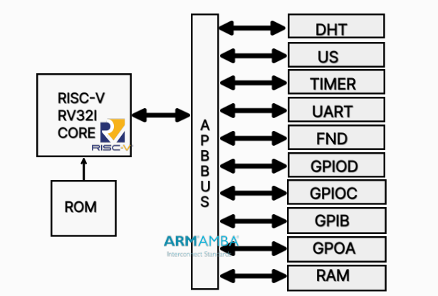

# RISC-V AMBA Peripheral 설계

2025.04.30 ~ 2025.05.06 (4人 팀 프로젝트)

## 요약
RISC-V 기반 RV32I 멀티사이클 CPU와 AMBA APB 버스를 활용해 UART-FIFO 기반 커스텀 주변장치 설계, UVM-Lite 기반 SystemVerilog로 기능 검증 및 C 애플리케이션 구현

- APB Bus와 연동되는 UART-FIFO 주변장치를 RTL로 직접 구현
- MicroBlaze 대신 RISC-V 기반 RV32I CPU를 자체 설계하여 APB read/write 테스트 수행
- UVM-lite 환경에서 TX/RX 시나리오를 랜덤 트랜잭션 기반으로 검증
- TDR/RDR 레지스터와 FND 디스플레이 연동 C 애플리케이션 구현

## 역할
- FIFO 기반 UART 송수신 IP RTL 설계 및 FSM, 상태 제어 로직 작성
- APB 슬레이브 인터페이스 설계 및 TDR, RDR, USR 레지스터 구현
- UVM 스타일 testbench(generator, driver, monitor, scoreboard) 개발 및 검증
- UART 루프 테스트용 C 애플리케이션 작성 및 디지털 센서 값 표시 기능 구현

## 트러블 슈팅

### [1] FIFO Push/Pop 타이밍 불일치 문제

 

자세히

- **문제 상황:**

TDR 레지스터에 값을 write한 후 TX FIFO에 데이터가 정상적으로 push되지 않음

- **원인 분석:**

Assembly 코드에서 FIFO push 타이밍과 TX 시퀀스 클럭(9600bps 기준 약 1ms)이 불일치

- **해결 방법:**

16clk 이상의 delay 루틴 삽입으로 FIFO push → TX pop 간 타이밍을 보장하고, loopback 테스트에서 송수신 타이밍 정상화

### [2] UVM 이벤트 연동 문제

 

자세히

- **문제 상황:**

Generator → Driver → Monitor → Scoreboard 간 mailbox 통신이 꼬이며 테스트 시 PASS 조건 미달

- **원인 분석:**

Monitor에서 발생한 수신 이벤트가 Scoreboard에 제대로 전달되지 않아 타이밍 mismatch 발생

- **해결 방법:**

event 객체 도입 및 class event 기반으로 generator와 scoreboard 간 타이밍 연동 개선

## 고찰

 고찰 

이번 프로젝트는 CPU, 버스(APB), 주변장치(UART), 디스플레이(FND), 그리고 검증 환경(UVM-lite)까지 모두 직접 설계 및 구현한 bottom-up 방식의 시스템 아키텍처 설계 경험이었다.

UART IP는 단순한 송수신뿐 아니라 FIFO 상태 레지스터(USR), TX busy 처리, Loopback 테스트까지 포함되어 실제 SoC에 가까운 형태로 구성하였다.

특히 SystemVerilog 기반 UVM 스타일 테스트벤치를 통해 기능 단위가 아닌 시스템 관점에서의 랜덤 검증을 수행해본 것은 추후 RTL Verification 실무에서도 중요한 경험이 될 것이다.

또한 C 애플리케이션 개발까지 병행하면서, HW/SW 연동의 중요성과 타이밍 조정의 실질적 어려움을 체감할 수 있었고, 전체 시스템을 아우르는 시야를 갖추는 계기가 되었다.

